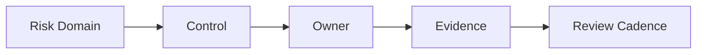

# Cloud Control Matrix

## Purpose

The control matrix maps cloud risks to the controls used to manage them and the evidence required to prove those controls.
It should work as the main operational table for control ownership and audit proof.

## Core Control Domains

- identity and access management
- network security
- data protection
- logging and monitoring
- incident response
- change management
- vulnerability management
- governance and exception handling
- third-party and supplier oversight
- backup and recovery assurance

## How To Use

1. Identify the applicable control domain.
2. Map the control to policy or regulatory need.
3. Record the owner and evidence source.
4. Review the control on a recurring cadence.
5. Flag any control that is weakly evidenced or overdue for testing.

## Example Control Notes

- high-risk controls should have explicit review ownership
- evidence should be named and easy to retrieve
- recurring control tests should be visible in the same page set

## Example Matrix Structure

| Risk Domain | Control | Owner | Evidence | Review Cadence |
| --- | --- | --- | --- | --- |
| Identity and access | Privileged access review | Security | Access review report | Monthly |
| Logging and monitoring | Centralized log retention | Platform | Log policy and export proof | Quarterly |
| Incident response | Escalation path | Operations | Incident runbook | Monthly |
| Data protection | Encryption baseline | Security | Key management proof | Quarterly |
| Recovery assurance | Backup verification | Infrastructure | Recovery test result | Monthly |

## Figure

## Use

Use this page as the core control reference for governance, audit, and compliance conversations.

## Outcome

A well-maintained matrix makes it easier to prove control coverage and spot gaps quickly.
