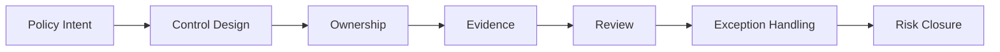

# Framework Overview

## What This Framework Does

This framework helps organizations govern cloud risk and compliance with a repeatable model for control ownership, evidence collection, audit preparation, and exception management.
It gives teams a common language for moving from policy intent to operational proof.
The framework is meant to make compliance easier to evidence without making operations harder to run.

## Governance Flow

## What It Covers

- cloud risk governance
- control ownership and accountability
- compliance mapping
- security control design
- audit evidence management
- Zero Trust control coverage
- executive reporting and risk tracking

## Who Uses It

- security leaders
- cloud governance teams
- compliance teams
- audit and assurance teams
- enterprise architects
- platform owners

## What Good Looks Like

- every major control has a named owner
- control design is mapped to a business or regulatory need
- evidence is current and easy to retrieve
- exceptions are time-bound and tracked
- leadership can review risk posture without manual translation
- control design, ownership, and evidence stay linked

## Outputs

- control matrix
- risk register
- audit readiness checklist
- control review template
- executive risk summary

## Control Layers

| Layer | Question | Artifact |
| --- | --- | --- |
| Policy | What should exist? | Policy or standard |
| Control | What must be enforced? | Control matrix |
| Evidence | What proves it happened? | Audit pack |
| Ownership | Who is accountable? | Ownership model |
| Review | What changed? | Exception log or risk register |

## Practical Value

When this framework is used consistently, teams spend less time reconstructing proof and more time closing real gaps.

## How To Read It

Start with the framework overview, then move into the control matrix and governance models.
That sequence keeps the focus on what needs to be proven before getting into supporting detail.

## Result

The framework helps teams keep controls, evidence, and ownership aligned across cloud environments.
